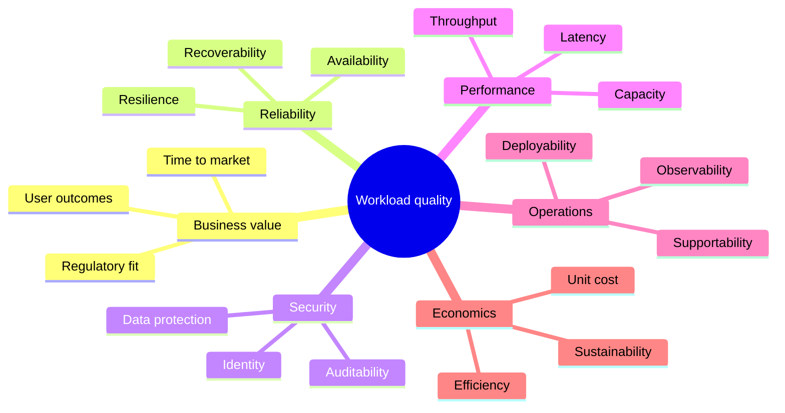

# Cloud Architecture & Distributed Systems

[← Curriculum overview](../curriculum/index.md) ·
[Master competency map](../master-competency-map.md)

Last reviewed: **2026-10-07**
Level: **Architect**

This pilot module builds the vendor-neutral reasoning needed before selecting
AWS, Azure, GCP, Kubernetes, database, or messaging services. AWS provides the
reference implementation; the same decisions are translated to Azure and
Google Cloud by capability and behavior.

!!! tip "Where to start"
    Start with **1. Core concepts** below and complete the pages in numbered
    order. The path separates learning, application, and assessment so you know
    when to read, practise, and test yourself. No cloud account or code is
    required.

## Learning objectives

By the end of the module, you should be able to:

- translate business goals into measurable non-functional requirements;
- distinguish scalability, elasticity, availability, reliability, resilience,
  durability, and fault tolerance;
- explain consistency and partition trade-offs without reducing CAP to a slogan;
- design overload controls using queues, backpressure, rate limits, and load shedding;
- select resilience patterns without creating retry storms or hidden coupling;
- choose stateful and stateless boundaries intentionally;
- design safe incremental delivery and recovery mechanisms;
- present architecture decisions, alternatives, evidence, and trade-offs clearly.

## Recommended module path

### Phase 1 — Learn the foundations

| Step | Page | Outcome |
| ---: | --- | --- |
| 1 | [Core concepts](concepts.md) | Establish precise architecture vocabulary |
| 2 | [Resilience and integration patterns](patterns.md) | Understand when patterns help and how they fail |
| 3 | [Capacity, SLO, RTO, and RPO example](capacity-slo-worked-example.md) | Turn business language into measurable targets |
| 4 | [AWS reference architecture](reference-architecture.md) | Connect the vendor-neutral model to an AWS design |
| 5 | [AWS decision matrix](decision-matrix.md) | Compare credible service choices |
| 6 | [Multi-cloud translation guide](multi-cloud.md) | Translate behavior without treating services as identical |
| 7 | [Architecture troubleshooting playbook](troubleshooting-playbook.md) | Move from symptom to evidence, mitigation, and prevention |

### Phase 2 — Apply the reasoning

| Step | Page | Outcome |
| ---: | --- | --- |
| 8 | [Architecture design exercise](lab.md) | Create your answer before seeing the walkthrough; no deployment required |
| 9 | [AWS design walkthrough](design-walkthrough.md) | Compare decisions with a reasoned example, not one model answer |
| 10 | [Scenario questions and model answers](scenarios.md) | Answer 15 core questions aloud before reading each answer |
| 11 | [Advanced scenario drills](scenario-drills.md) | Practise 12 ambiguous and failure-oriented follow-ups |
| 12 | [Ten-minute presentation](presentation-template.md) | Present decisions and trade-offs instead of describing boxes |

### Phase 3 — Revise and assess

| Step | Page | Outcome |
| ---: | --- | --- |
| 13 | [Rapid-fire revision](rapid-fire.md) | Check concise verbal recall |
| 14 | [Active-recall flashcards](flashcards.md) | Revisit weak concepts using spaced repetition |
| 15 | [Timed mock interview](../mock-interviews/cloud-architecture.md) | Complete the 50-minute assessment and record the score |
| 16 | [References and videos](references.md) | Deepen weak areas with primary and durable sources |

## Completion checklist

- [ ] I can explain every learning objective without reading the page.
- [ ] I completed the design lab before reading the walkthrough.
- [ ] I answered all 27 scenarios aloud.
- [ ] I can present the recommendation, trade-offs, and failure behavior in ten minutes.
- [ ] I completed the mock interview and recorded evidence for weak dimensions.

## Architecture quality model

Architecture is a set of decisions made under constraints. A useful design
balances multiple qualities rather than maximizing one in isolation.

## Before drawing a diagram

Capture at least:

- business outcome and critical user journeys;
- steady-state and peak demand, data volume, and growth;
- latency and throughput objectives;
- availability target, RTO, RPO, and failure domains;
- data classification, residency, retention, and compliance;
- budget, unit economics, delivery deadline, and team capability;
- current-state dependencies and migration constraints.

!!! warning "False precision"
    A detailed diagram built on unknown requirements is not a detailed design.
    State assumptions explicitly and identify which ones could change the
    architecture.

## Evidence expected in a senior interview

A strong answer contains more than a happy-path diagram:

- alternative approaches and selection criteria;
- capacity assumptions and scale boundaries;
- failure modes, blast radius, and recovery behavior;
- security and trust boundaries;
- deployment, rollback, telemetry, and operational ownership;
- major cost drivers and a validation plan;
- a phased implementation rather than a single high-risk cutover.
