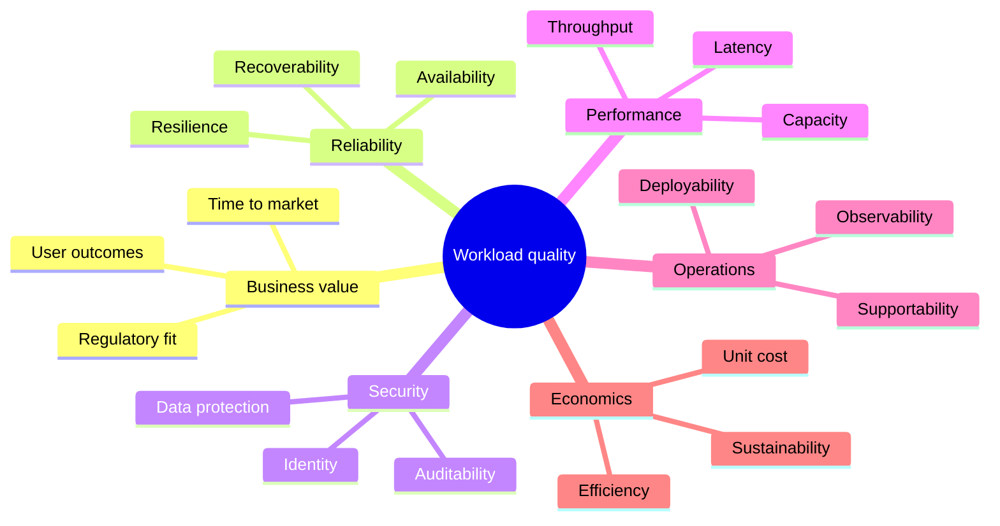

# Cloud Architecture & Distributed Systems

Last reviewed: **2026-09-02**
Level: **Architect**

This pilot module builds the vendor-neutral reasoning needed before selecting
AWS, Azure, GCP, Kubernetes, database, or messaging services.

## Learning objectives

By the end of the module, you should be able to:

- translate business goals into measurable non-functional requirements;
- distinguish scalability, elasticity, availability, reliability, resilience,
  durability, and fault tolerance;
- explain consistency and partition trade-offs without reducing CAP to a slogan;
- design overload controls using queues, backpressure, rate limits, and load shedding;
- select resilience patterns without creating retry storms or hidden coupling;
- choose stateful and stateless boundaries intentionally;
- design safe incremental delivery and recovery mechanisms;
- present architecture decisions, alternatives, evidence, and trade-offs clearly.

## Module path

1. [Core concepts](concepts.md)
2. [Resilience and integration patterns](patterns.md)
3. [Scenario questions and model answers](scenarios.md)
4. [Hands-on architecture lab](lab.md)
5. [References and videos](references.md)

## Architecture quality model

Architecture is a set of decisions made under constraints. A useful design
balances multiple qualities rather than maximizing one in isolation.

## Before drawing a diagram

Capture at least:

- business outcome and critical user journeys;
- steady-state and peak demand, data volume, and growth;
- latency and throughput objectives;
- availability target, RTO, RPO, and failure domains;
- data classification, residency, retention, and compliance;
- budget, unit economics, delivery deadline, and team capability;
- current-state dependencies and migration constraints.

!!! warning "False precision"
    A detailed diagram built on unknown requirements is not a detailed design.
    State assumptions explicitly and identify which ones could change the
    architecture.

## Evidence expected in a senior interview

A strong answer contains more than a happy-path diagram:

- alternative approaches and selection criteria;
- capacity assumptions and scale boundaries;
- failure modes, blast radius, and recovery behavior;
- security and trust boundaries;
- deployment, rollback, telemetry, and operational ownership;
- major cost drivers and a validation plan;
- a phased implementation rather than a single high-risk cutover.
