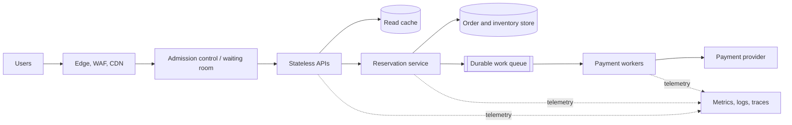

# Hands-on Architecture Lab

## Design for a scheduled ten-times traffic spike

Last reviewed: **2026-10-04**
Estimated time: **4–6 hours**
Expected cloud cost: **None for the design-only path**

## Objective

Produce and defend an architecture for a global ticket-release platform with a
large scheduled demand spike. The lab assesses requirements discovery,
capacity reasoning, failure design, security, observability, cost, and
communication—not diagram aesthetics.

## Scenario

A company releases event tickets at 18:00 UTC every Friday.

- Ten million registered users
- 100,000 normal daily active users
- Up to one million concurrent users during release
- Browsing is read-heavy; reservations and payment are write-heavy
- A seat must not be sold twice
- Customers expect a response within two seconds
- Target availability is 99.95% for the purchase journey
- Confirmed orders have an RPO approaching zero
- Regional data-residency rules apply to customer identity data
- The business accepts a virtual waiting room
- Initial implementation must be delivered in twelve weeks

## Tasks

### 1. Clarify and quantify

Create an assumptions table. Estimate peak requests per second for browsing,
reservation, and payment. Identify which assumptions most affect the design and
which require product-owner confirmation.

### 2. Define service objectives

Define at least:

- purchase-journey availability and latency indicators;
- queue-admission and waiting-time objectives;
- reservation correctness invariant;
- RTO and RPO for ordering and browsing;
- backlog age and payment-reconciliation objectives.

### 3. Produce two architecture options

At minimum compare:

- a simpler single-region, multi-zone system with cross-region recovery;
- a multi-region serving design with an explicit write and consistency model.

Do not select a vendor service until the required capability is clear.

### 4. Draw the logical architecture

Include clients, edge controls, admission/waiting room, APIs, caches, queues,
reservation, payment integration, systems of record, telemetry, and operator
controls.

The diagram is a starting point, not a model answer. Change it when your
requirements or selected option demand a different boundary.

### 5. Walk through failures

For each failure, document detection, immediate behavior, user impact, recovery,
and evidence that proves recovery:

1. Cache fails cold at peak.
2. One availability zone becomes unreachable.
3. Payment times out after accepting a charge.
4. Queue consumers stop for thirty minutes.
5. Database write latency triples.
6. A bad release affects one reservation route.
7. The primary region is unavailable.

### 6. Design delivery and operations

Specify progressive delivery stages, rollback signals, dashboards, paging
alerts, runbooks, ownership, and a game-day plan. Explain how database and event
schema changes remain backward compatible.

### 7. Estimate cost and delivery risk

Identify major cost drivers and calculate a per-confirmed-order unit cost. Show
what is pre-provisioned for the weekly event and what remains elastic. Create a
twelve-week incremental delivery plan with risk-reduction milestones.

## Deliverables

- Requirements and assumptions table
- Context and container-level architecture diagrams
- Two-option decision record
- Capacity model
- Failure-mode and effects table
- SLI/SLO and alert proposal
- Security and trust-boundary notes
- Cost-driver and unit-economics model
- Twelve-week implementation plan
- Ten-minute spoken architecture presentation

## Scoring rubric

| Area | Weight | Strong evidence |
| --- | ---: | --- |
| Requirements | 15% | Quantified demand, invariants, RTO/RPO, constraints |
| Architecture | 20% | Clear boundaries, data flow, state, and alternatives |
| Reliability | 20% | Failure domains, overload control, recovery, exercises |
| Security | 10% | Identity, trust boundaries, encryption, audit, residency |
| Operations | 15% | SLOs, telemetry, deployment, rollback, ownership |
| Cost | 10% | Cost drivers, unit cost, elasticity, trade-offs |
| Communication | 10% | Explicit assumptions, rationale, risks, phased plan |

## Optional implementation path

Continue with the staged [AWS implementation guide](implementation-guide.md)
and the `labs/aws/01-cloud-architecture-ticketing` workspace in the repository.
Prove correctness locally before provisioning AWS, then add the
single-Region core, admission controls, delivery, observability, load testing,
failure experiments, and measured recovery.

Use [AWS reference architecture](reference-architecture.md) for service
selection and [multi-cloud translation](multi-cloud.md) when evaluating Azure
or Google Cloud alternatives.

## Teardown

The base lab requires no cloud resources. If you extend it into a cloud account,
record every resource before creation, use a dedicated sandbox, set a budget
alert, and verify that compute, databases, load balancers, public IP addresses,
logs, snapshots, and retained storage are removed afterward.
