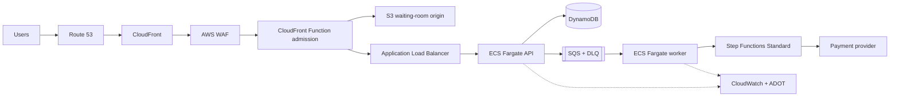

# AWS Reference Architecture

Last reviewed: **2026-10-04**

Level: **Advanced / Architect**

This page converts the vendor-neutral ticketing design into a concrete AWS
reference architecture. It is a starting position, not a claim that every
workload needs every service.

## Design principles

- Control admission before demand reaches expensive stateful components.
- Preserve inventory correctness with an atomic write, not a read-then-write flow.
- Make every externally retried command idempotent.
- Separate synchronous customer acknowledgement from durable background work.
- Bound timeouts, retries, queue growth, and blast radius.
- Measure business outcomes as well as infrastructure health.
- Prove recovery; a second Region or backup alone is not proof.

## Reference flow



## Service decisions

| Capability | AWS starting choice | Why it fits | Reconsider when |
| --- | --- | --- | --- |
| DNS | Route 53 | Health-aware routing and AWS integration | An enterprise DNS platform owns all zones |
| Edge | CloudFront + AWS WAF | Caching, edge logic, rate controls, managed rules | Existing CDN contracts or sovereignty constraints dominate |
| Compute | ECS on Fargate | Container portability without cluster-node operations | Lambda fits short event handlers, or Kubernetes is an established platform standard |
| Load balancing | Application Load Balancer | HTTP routing and ECS target health | API Gateway capabilities or private service networking are primary requirements |
| Inventory | DynamoDB | Conditional writes, managed scaling, low-latency key access | Relational constraints and cross-entity transactions dominate |
| Durable buffer | SQS standard queue + DLQ | At-least-once work delivery and load leveling | Ordered processing requires a FIFO design and its throughput constraints are acceptable |
| Workflow | Step Functions Standard | Visible, durable saga state and compensation | A simpler worker state machine is sufficient or workflow portability is required |
| Secrets | Secrets Manager / Parameter Store | Runtime retrieval and IAM integration | Enterprise secret management is mandated |
| Telemetry | CloudWatch + ADOT | Native metrics/logs plus portable OpenTelemetry signals | Central observability platform is the operating standard |
| Delivery | GitHub Actions OIDC + ECR | Short-lived federation and immutable images | An enterprise delivery platform owns deployment |

## Correctness model

The inventory record owns the seat state. A reservation uses a DynamoDB
conditional update that succeeds only when the item is available or an expired
hold can be safely reclaimed. The idempotency record binds one client key to
one request fingerprint and stored result.

```text
AVAILABLE --conditional hold--> HELD --payment success--> CONFIRMED
                              \--expiry/known failure--> AVAILABLE
```

Never make payment retries independent of payment-provider idempotency. A
timeout can mean the charge succeeded but the response was lost. Such results
enter reconciliation until the provider confirms their state.

## Network and identity boundaries

- CloudFront is the public entry point; the S3 waiting-room origin is not public.
- The load balancer is public only if CloudFront-to-origin protection is defined.
- ECS tasks run without public IP addresses in private subnets.
- API and worker task roles are separate and grant access to specific resources.
- Administrative access uses federation and audited automation, not SSH keys.
- Network egress, NAT gateway cost, and VPC endpoints are conscious decisions.

## Availability and recovery

The core deployment spans at least two Availability Zones. Stateless tasks are
replaceable, SQS buffers transient processing loss, and DynamoDB point-in-time
recovery protects against selected data-loss scenarios. Each mechanism must be
tested against a named failure.

Start with single-Region multi-AZ service and cross-Region recovery. Add
DynamoDB Global Tables or multi-Region serving only after defining:

- write ownership and conflict behavior;
- regional dependency isolation;
- identity and order-data residency;
- queue and workflow behavior during failover;
- failback and reconciliation;
- measured RTO and RPO.

## Overload controls

Use layered controls rather than relying on autoscaling alone:

1. CDN caching reduces repeat reads.
2. The waiting room limits admitted purchase journeys.
3. WAF rate rules constrain abusive clients.
4. API concurrency and timeouts cap resource use.
5. SQS absorbs work within a declared maximum backlog age.
6. Workers scale from backlog-per-task and message age.
7. Non-critical functions shed load before the purchase invariant is endangered.

## Minimum telemetry

Monitor customer outcome, saturation, and recovery:

- admission rate, rejection rate, and waiting time;
- purchase success rate and end-to-end latency percentiles;
- ALB target errors and latency;
- ECS desired versus running tasks and task restarts;
- DynamoDB latency, throttling, and conditional-check failures;
- SQS age of oldest message and DLQ depth;
- payment outcomes, unknown states, and reconciliation age;
- deployment version and rollback signal.

## Delivery evolution

1. Local correctness proof with concurrent reservation tests.
2. Single-Region AWS sandbox deployment.
3. Edge admission, security controls, and observability.
4. Progressive delivery and automated rollback evidence.
5. Load, fault, restore, and game-day validation.
6. Optional multi-Region experiment based on measured recovery needs.

Record significant choices using the lab's Architecture Decision Record template.
