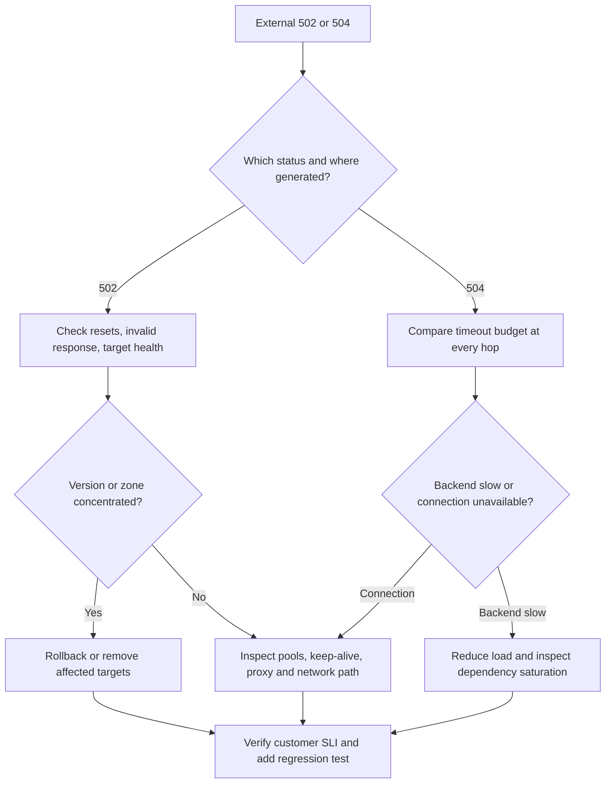

# Architecture Troubleshooting Playbook

[← Module overview](index.md) · [Master competency map](../master-competency-map.md)

Last reviewed: **2026-10-07**

Troubleshooting answers should move from symptom to evidence to mitigation to
prevention. Avoid changing several timeouts or scaling components at once.

## Universal sequence

1. Confirm customer impact, start time, scope, and critical journey.
2. Check recent deployments, configuration, traffic, and dependency changes.
3. Segment by region, zone, version, route, tenant, and outcome.
4. Trace one failed request across edge, service, state, and dependency boundaries.
5. Stabilize with the safest reversible action.
6. Verify recovery using the customer SLI and backlog/reconciliation state.
7. Preserve evidence and assign prevention work.

## 502 and 504 responses

Do not simply increase the load-balancer timeout. That can retain more work,
increase concurrency, and worsen saturation.

## Queue backlog

Ask:

- Is arrival rate greater than processing rate?
- Did consumers stop, slow down, or repeatedly fail one message?
- Is message age growing even if depth appears stable?
- Is visibility timeout shorter than processing time?
- Are retries amplifying dependency calls?
- Is the DLQ receiving poison messages?

Stabilize by controlling admission, restoring known-good consumers, and isolating
poison work. Calculate drain time. Never purge a queue merely to make a graph green.

## Database latency with low total utilization

Low average utilization can hide:

- a hot partition or key;
- lock contention;
- connection-pool exhaustion;
- one slow query or access pattern;
- storage or replication latency;
- cross-region calls;
- retry amplification.

Segment evidence by key/access pattern and call path. Scale only after determining
whether the constraint is total capacity, skew, concurrency, or inefficient work.

## Duplicate orders or payments

Trace one business identifier and ask:

1. Which caller retried, and what timeout triggered it?
2. Was the operation idempotent at the business boundary?
3. Was the same key reused with a different payload?
4. Could a message be delivered more than once?
5. Did the provider accept work before its response was lost?
6. Which system is authoritative for reconciliation?

Stop unsafe retries before cleaning data. Preserve payment-provider and order
evidence, reconcile unknown outcomes, then repair state through an audited process.

## Cache failure at peak

Protect the origin before restoring the cache:

- reduce admission and shed optional reads;
- prevent every instance from rebuilding the same key;
- use jittered expiry and request coalescing;
- restore only tested cache capacity;
- verify correctness does not depend on cached data.

Measure origin load, cache hit rate, rebuild rate, and customer latency during recovery.

## Regional impairment

Before failover, establish:

- whether the failure is application, zonal, regional, or global dependency;
- whether the recovery Region has capacity and current data;
- who owns writes and how split brain is prevented;
- what happens to queues, workflows, and in-flight payments;
- how clients are rerouted and later failed back.

Failing over a healthy write path based on an ambiguous health check can create
a larger incident than the original impairment.

## Strong interview language

> I would first reduce uncertainty and customer impact. I will identify the
> failing boundary using request correlation and segmented service evidence,
> choose one reversible mitigation, and verify recovery with the customer SLI.
> After stabilization I will reconcile durable work, measure recovery against
> the objective, and add the smallest control or test that would have detected
> or prevented this failure earlier.
