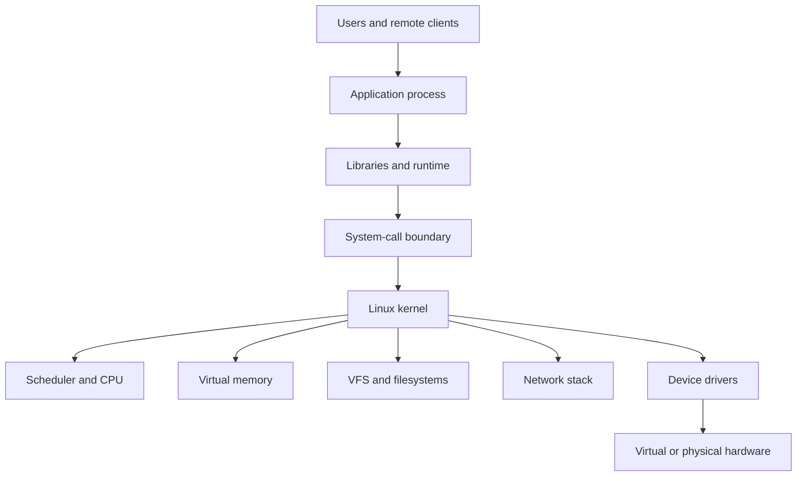

# Operating-System Mental Model

[← Module overview](index.md) · [Master competency map](../master-competency-map.md)

Last reviewed: **2026-10-07**

## The smallest useful model

A Linux host turns application intent into controlled access to CPU time,
memory, devices, files, and network communication.

User-space programs cannot directly manipulate protected hardware or kernel
state. They request kernel work through system calls. This boundary explains
why an application can be healthy while blocked in kernel I/O, and why host
metrics alone cannot prove that an application is correct.

## Kernel space and user space

| Area | Owns | Typical evidence | Failure examples |
| --- | --- | --- | --- |
| User space | Application logic, runtimes, libraries, configuration | Application logs, process state, traces | Deadlock, leak, bad configuration, exhausted pool |
| Kernel space | Scheduling, memory, filesystems, sockets, devices, isolation | Kernel log, `/proc`, pressure and device metrics | OOM kill, hung I/O, driver failure, conntrack exhaustion |
| Cloud/virtualization layer | VM lifecycle, virtual devices, host placement, managed disks and network | Provider health, serial output, status checks, control-plane events | Host impairment, volume issue, maintenance, quota or API failure |

A senior diagnosis asks which layer owns the failed behavior before choosing a
tool or remediation.

## Processes, threads, and file descriptors

A process has an address space, credentials, namespaces, resource limits, open
file descriptors, and one or more threads. Threads share much of the process
state but are independently schedulable.

File descriptors are handles for more than files: sockets, pipes, devices,
event notification objects, and other kernel resources use them. A service can
therefore fail with “too many open files” even when filesystem capacity is
healthy. Investigate both per-process and system-wide limits, the descriptor
types, and why they remain open.

## Process states as evidence

| State | Meaning | Interview implication |
| --- | --- | --- |
| Running/runnable | Executing or waiting for CPU | Many runnable tasks can indicate CPU saturation or lock contention |
| Interruptible sleep | Waiting for an event and can receive signals | Common and not inherently unhealthy |
| Uninterruptible sleep | Usually waiting in a kernel I/O path | Persistent counts can indicate storage, filesystem, or device problems |
| Stopped/traced | Suspended by signal or debugger | Check operator action, job control, or debugging |
| Zombie | Exited but parent has not collected status | Small transient counts are normal; growth suggests parent lifecycle defects |

The state is a clue, not a diagnosis. Correlate it with duration, customer
impact, wait channel, resource pressure, and recent change.

## Resource model

Every request consumes a combination of:

- CPU time and scheduler attention;
- resident memory and page cache;
- file descriptors, sockets, and kernel memory;
- storage throughput, IOPS, queue time, and capacity;
- network bandwidth, buffers, connections, and name resolution;
- locks, connection pools, and application-level concurrency.

The first exhausted resource may be a configured limit rather than physical
capacity. Examples include a systemd task limit, cgroup memory limit, process
file-descriptor limit, cloud-volume throughput ceiling, or connection-tracking
table.

## Utilization, saturation, and errors

- **Utilization** describes how busy a resource is.
- **Saturation** describes queued work or delay because demand exceeds service capacity.
- **Errors** show work that failed or was rejected.

High utilization without waiting may be efficient. Moderate aggregate
utilization with one saturated CPU, disk, cgroup, or queue can still cause poor
latency. Always segment by resource, workload, time, and failure domain.

## Namespaces and cgroups

Namespaces change what a process can see: process IDs, mounts, networks, host
names, users, IPC resources, and other views can be isolated. Cgroups account
for and control resources such as CPU and memory.

Neither mechanism is a complete security boundary by itself. Container safety
also depends on kernel attack surface, capabilities, seccomp or LSM policy,
filesystem access, device exposure, runtime configuration, and patching.

## Boot and shutdown chain

A useful high-level boot model is:

1. firmware and virtual platform initialize;
2. bootloader selects and loads kernel and initial RAM filesystem;
3. kernel discovers hardware and mounts the initial root;
4. the real root filesystem becomes available;
5. PID 1 starts units required for the target state;
6. services become ready and traffic is admitted.

During shutdown, ordering matters just as much: stop accepting work, drain or
checkpoint it, stop dependents, unmount safely, and power down. A process exit
does not prove queued or buffered work is durable.

## Common reasoning mistakes

- Treating load average as CPU percentage.
- Treating free memory near zero as a leak without considering page cache.
- Restarting a service before preserving evidence or understanding dependencies.
- Assuming a VM “running” state proves that the guest OS and application are healthy.
- Changing kernel parameters before identifying the actual constrained resource.
- Using one snapshot instead of a time-correlated comparison with a healthy period.
