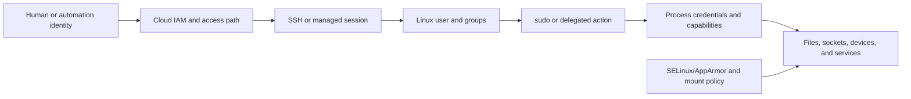

# Identity, Permissions, and Secure Access

[← Module overview](index.md) · [Master competency map](../master-competency-map.md)

Last reviewed: **2026-10-07**

## Security model

Linux access decisions combine process credentials, file ownership and mode,
ACLs, capabilities, namespaces, security modules, mount options, and service
configuration. Cloud identity and network controls form additional boundaries.

## Permissions reasoning

Traditional mode bits apply to owner, group, and others. Directories require
execute permission to traverse and write permission to add or remove entries.
Deletion is governed primarily by the parent directory, not the target file’s
write bit.

Additional factors include:

- default and access ACLs;
- set-user-ID, set-group-ID, and sticky behavior;
- process `umask`;
- filesystem and mount restrictions;
- SELinux or AppArmor decisions;
- read-only roots and service sandboxing;
- user namespace mappings.

Never “fix” a permission incident with broad recursive `777`. Determine the
required subject, object, operation, and policy layer.

## Root and capabilities

Root bypasses many discretionary checks and is therefore a large blast radius.
Linux capabilities split selected privileges, but an excessive capability set
can still enable host compromise. Give a service only the identity,
capabilities, paths, and devices required for its job.

## sudo and privileged operations

Good delegation is command- and role-specific, attributable, time-bounded where
possible, and logged. Avoid unrestricted shells hidden inside apparently narrow
commands. Operational procedures should identify what evidence is collected
before privilege escalation and what changes are authorized.

## SSH and managed access

Prefer centralized identity or short-lived access over shared static keys.
Control:

- who can request a session and through which network path;
- host identity verification and key rotation;
- permitted authentication methods;
- source restrictions and bastion/managed-session design;
- session attribution and audit retention;
- emergency access with approval and post-use review.

On AWS, Systems Manager Session Manager can reduce inbound SSH exposure, but it
introduces dependencies on agent health, instance identity, endpoints, IAM, and
the Systems Manager service. Keep a tested break-glass or serial-console path
appropriate to the workload’s risk.

## Secrets and logs

Secrets must not appear in process arguments, shell history, environment dumps,
support bundles, logs, or world-readable files. Prefer a managed secret source,
short-lived credentials, controlled file descriptors or memory delivery, and
explicit rotation behavior.

Support artifacts can contain hostnames, IP addresses, usernames, command
history, environment, keys, or customer data. Minimize collection, restrict
access, encrypt transfer and storage, define retention, and sanitize before
committing any summary.

## Patch and vulnerability decisions

Patch urgency depends on exploitability, exposure, privilege gained, available
mitigations, workload criticality, and rollback confidence. A sound fleet
strategy includes:

- trusted image and package sources;
- version and inventory evidence;
- staged rollout and health gates;
- kernel/live-patch or reboot decision;
- rollback or replacement path;
- verification that old vulnerable instances are drained and removed.

## Common mistakes

- Treating a security group as a substitute for host identity and authorization.
- Sharing administrator accounts or private keys.
- Granting root because least privilege takes longer to design.
- Disabling SELinux/AppArmor instead of understanding a denial.
- Logging tokens while debugging authentication.
- Patching in place without fleet rollout, health checks, or replacement evidence.
