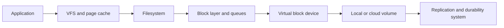

# Storage and Filesystems

[← Module overview](index.md) · [Master competency map](../master-competency-map.md)

Last reviewed: **2026-10-07**

## Storage path

Latency or failure can arise at any boundary. A cloud volume health metric does
not prove that the filesystem is mounted read-write, the inode table has space,
or the application can safely persist its data.

## Capacity has several dimensions

| Dimension | Exhaustion symptom |
| --- | --- |
| Bytes | Writes fail, logs stop, packages or services malfunction |
| Inodes | New files fail despite apparent free bytes |
| IOPS | Requests queue even when throughput is below its ceiling |
| Throughput | Large sequential work saturates bandwidth |
| Queue depth/latency | Work waits behind slow or excessive requests |
| Filesystem metadata | Directory, journal, lock, or allocation contention |
| Cloud burst credits or quota | Performance drops after a temporary burst window |

## Full filesystem response

Do not begin with broad deletion.

1. Confirm the affected mount, byte use, inode use, and growth rate.
2. Identify which writer and file class is growing.
3. Preserve evidence and determine retention or ownership requirements.
4. Stop or constrain unsafe growth if it will not worsen recovery.
5. Free space using an approved, targeted, recoverable action.
6. Check deleted-but-open files and application behavior.
7. Verify service recovery, logging, rotation, and alerting.
8. Correct retention, quotas, partitioning, or capacity policy.

Deleting an open file may not release blocks until the owning process closes
its descriptor. Restarting the process can release space but may also destroy
evidence or interrupt critical work.

## Mounts and startup safety

Mount configuration must account for stable identifiers, dependency ordering,
timeouts, optional versus required data, and degraded boot behavior. A missing
non-critical volume should not necessarily prevent emergency access, while a
missing authoritative data volume must not allow the application to write into
an unintended empty directory.

## Durability and consistency

An acknowledged application write may exist in a process buffer, page cache,
filesystem journal, device cache, or durable replicated storage. Define where
the durability boundary actually is. `fsync` semantics, database configuration,
filesystem choice, cloud-volume guarantees, and application recovery protocol
all contribute.

Snapshots and backups are not interchangeable:

- a crash-consistent snapshot captures storage at a point in time but may need
  application recovery;
- an application-consistent backup coordinates transactional state;
- a replica may copy corruption or operator error;
- only a restore test demonstrates recoverability and measured RTO/RPO.

## I/O troubleshooting

Ask:

- Which operation became slow: read, write, sync, metadata, or mount?
- Is latency inside the application, filesystem, block queue, or provider volume?
- Did request size, concurrency, access pattern, or data placement change?
- Is one device, partition, cgroup, tenant, or process responsible?
- Are errors, retries, timeouts, or filesystem remount events present?
- Are cloud IOPS, throughput, queue, or burst limits reached?

Avoid using `%util` or one aggregate device metric as a universal saturation
signal. Device parallelism and tool semantics differ.

## Safe recovery principles

- Snapshot or otherwise preserve recoverable state before invasive repair.
- Avoid filesystem repair on a mounted read-write filesystem unless its documented procedure permits it.
- Prefer replacement from known-good images when the host is disposable.
- Reconcile application state after storage or filesystem recovery.
- Separate emergency capacity relief from the permanent retention and scaling fix.
