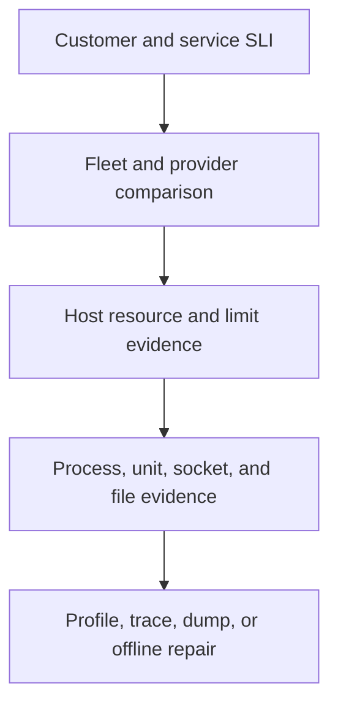
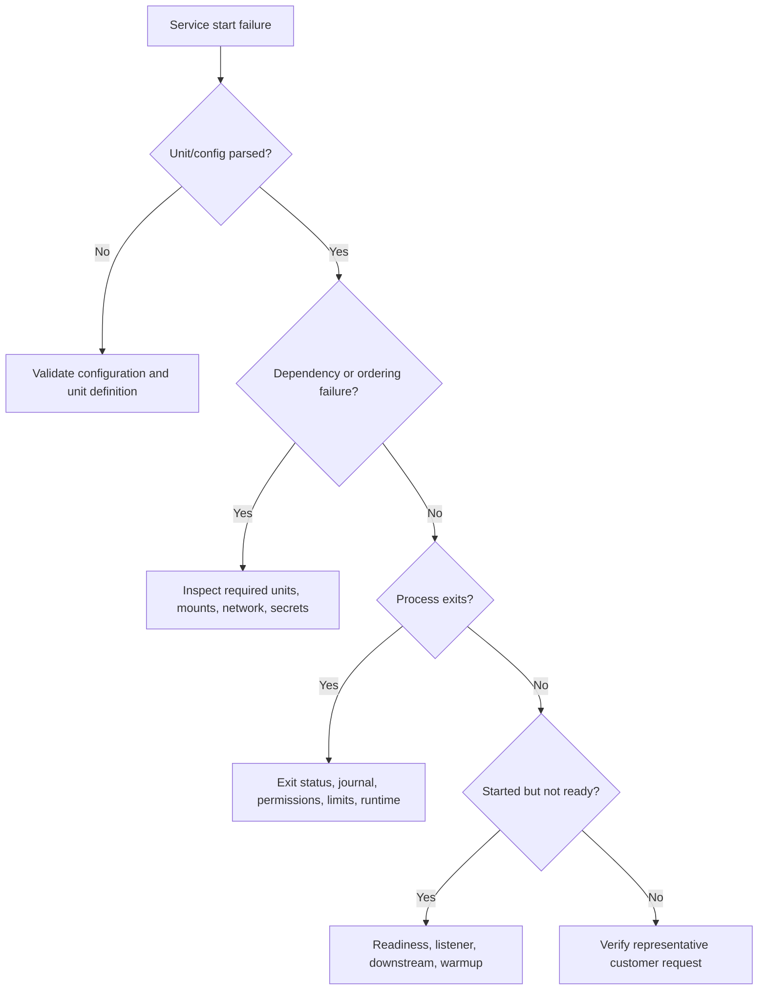

# Linux Troubleshooting Playbook

[← Module overview](index.md) · [Master competency map](../master-competency-map.md)

Last reviewed: **2026-10-07**

## Universal sequence

1. Confirm customer impact, start time, scope, and critical journey.
2. Establish a healthy comparison: host, zone, version, tenant, or earlier period.
3. Check recent change, demand, errors, saturation, and configured limits.
4. Locate the failing layer and resource boundary.
5. Form one falsifiable hypothesis.
6. Capture only the evidence required to test it.
7. Apply one authorized, reversible mitigation.
8. Verify recovery with the customer signal.
9. Reconcile unfinished or duplicated work.
10. Correct the design, automation, alert, or runbook weakness.

## Evidence pyramid

Move from low-overhead, broad evidence toward focused and potentially invasive
evidence.

Profiles, core dumps, packet captures, and support bundles may be expensive or
sensitive. Define authorization, duration, scope, storage, and deletion before
collection.

## Symptom decision table

| Symptom | First distinctions | Avoid |
| --- | --- | --- |
| Service unavailable | DNS/network path, listener, unit/process state, dependency, fleet scope | Immediate restart of every instance |
| High latency | Demand, CPU/run queue, memory pressure, I/O, locks, downstream time | Scaling only from aggregate CPU |
| Host unreachable | Cloud health, network path, guest boot, SSH policy, serial/managed access | Assuming SSH failure means VM failure |
| Process killed | Exit code, OOM scope, signal sender, service timeout, operator action | Increasing restart count without cause |
| Filesystem full | Mount, bytes, inodes, writer, open-deleted files, growth rate | Broad deletion or log truncation without ownership |
| Read-only filesystem | Kernel/device errors, mount event, data risk, provider volume status | Remounting read-write before understanding corruption risk |
| High load but low CPU | Uninterruptible I/O wait, locks, cgroup limits, runnable imbalance | Treating load as CPU percentage |
| Intermittent failures | Host/zone/version/tenant segmentation, resource limits, timeouts | Averaging away the failing population |

## Service will not start

## CPU or memory incident

- Identify whether the customer is waiting and where.
- Compare run queue, per-CPU use, throttling, pressure, faults, reclaim, and swap activity.
- Attribute consumption to process, thread, cgroup, host, and version.
- Check recent demand and deployment changes.
- Reduce admission, remove a bad instance/version, or add bounded capacity.
- Preserve evidence before restart if a leak, deadlock, or runaway loop is suspected.

## Disk and filesystem incident

- Separate capacity, inode, latency, device-error, mount, and consistency failures.
- Identify the writer and durability requirements.
- Use approved targeted relief; do not delete unknown data.
- If corruption or device failure is possible, protect state before repair.
- Verify application reconciliation, retention, and growth alerts afterward.

## Failed boot or lost access

1. Check provider lifecycle and health signals.
2. Review serial/console output and boot diagnostics.
3. Distinguish bootloader, kernel/initramfs, root mount, systemd, network, and access-policy failures.
4. Boot a known prior kernel or recovery environment only under a documented procedure.
5. Snapshot and attach the OS disk to a repair host when offline repair is safer.
6. Prefer replacement from a corrected image when state is externalized.
7. Verify credentials, host identity, telemetry, and application state after recovery.

## Strong interview language

> I will begin with the customer symptom and a healthy comparison, then locate
> the failing layer before choosing a command. I will preserve bounded evidence,
> make one reversible mitigation, verify recovery through the customer SLI, and
> reconcile any interrupted work. A restart may be a mitigation, but it is not
> the diagnosis or the permanent fix.
