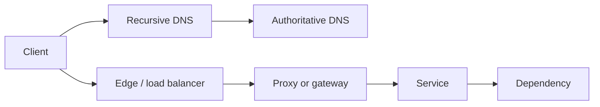

# Network Mental Model

[← Module overview](index.md) · [Master competency map](../master-competency-map.md)

Last reviewed: **2026-10-10**

## Trace the customer flow

A useful model follows one request rather than treating layers as isolated facts.

For every arrow, identify:

- source and destination identity, address, port, and protocol;
- name resolution and which resolver/cache supplied the answer;
- route selection, next hop, and return path;
- stateful and stateless policy enforcement;
- address translation or proxy termination;
- timeout, retry, health, and failure behavior;
- telemetry owner and administrative boundary.

## Layers are diagnostic boundaries

| Boundary | Evidence question | Common false conclusion |
| --- | --- | --- |
| Name resolution | Which name, record type, answer, resolver, TTL, and authority? | “DNS works” because one resolver returned one answer |
| Network reachability | Is there a route and permitted forward/return path? | Ping failure proves the host is unavailable |
| Transport | Did the connection establish, reset, or time out? | An open port proves the application is healthy |
| TLS | Did trust, identity, version, SNI, and negotiation succeed? | A certificate is valid because its date is current |
| HTTP/application | Which status, latency, route, dependency, and request ID? | A load-balancer health check proves customer success |

The OSI model supplies vocabulary. Troubleshooting requires evidence at the
boundaries between layers, devices, teams, and control planes.

## Packet path versus request path

A packet path describes forwarding. A request path includes DNS, connection
pooling, TLS termination, proxy routing, authentication, retries, queues, and
application dependencies. Modern services can succeed at the packet layer and
still fail at every higher boundary.

## Control plane and data plane

- The **control plane** stores intent: routes, policies, DNS records, listeners,
  targets, and configuration.
- The **data plane** forwards actual traffic using programmed state.

A successful API update does not prove propagation, data-plane convergence, or
end-to-end success. Validate from a representative source and destination.

## State and direction

Networking is directional. Record the initiating side, ephemeral source port,
destination port, forward policy, return route, translation state, and idle
timeout. Stateful controls usually allow related return traffic; stateless
controls require explicit rules in both directions.

## Failure classifications

Classify before changing anything:

- all clients or one location/identity;
- one address family, resolver, protocol, or endpoint;
- timeout, refusal/reset, TLS error, HTTP error, or degraded latency;
- new connections only or established connections too;
- single zone, subnet, route table, target group, or software version;
- steady failure or intermittent failure correlated with load/change.

## Evidence principles

Prefer the least invasive evidence that can reject a hypothesis. Flow logs,
resolver logs, load-balancer logs, connection metrics, route analysis, and
bounded packet captures answer different questions. Captures can expose tokens,
identifiers, addresses, and payloads; authorize, filter, encrypt, retain, and
delete them according to policy.

## Strong interview answer

State the customer impact, draw the expected path, name the first failing
boundary, propose two plausible causes, request discriminating evidence, choose
a reversible mitigation, and verify the original customer journey.
