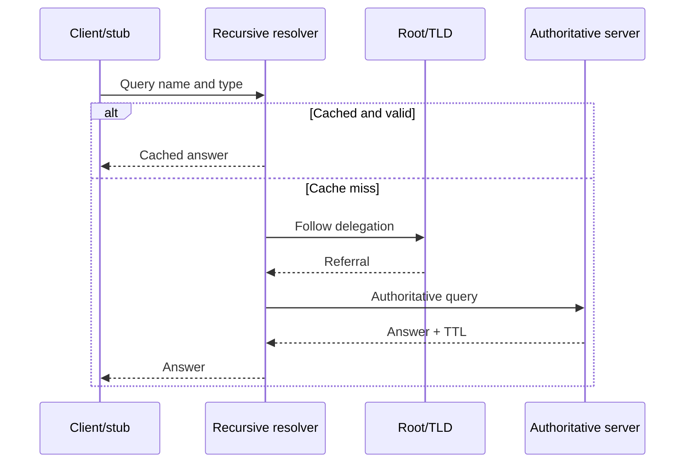

# DNS and Service Discovery

[← Module overview](index.md) · [Master competency map](../master-competency-map.md)

Last reviewed: **2026-10-10**

## Resolution path

Always capture the queried name, record type, resolver, answer, response code,
authority, TTL, and whether the response was cached. “It resolves for me” is not
enough when clients use different resolvers, views, address families, or caches.

## Records and delegation

| Concept | Key reasoning |
| --- | --- |
| A / AAAA | Address answers for IPv4 / IPv6; clients may prefer one family |
| CNAME | Alias requiring another lookup; not normally used at a zone apex |
| Alias/flattening | Provider behavior that returns address-like answers at an apex |
| NS and delegation | Parent identifies authoritative servers for a child zone |
| MX | Mail routing plus preference, not a general service endpoint |
| TXT | Unstructured policy/verification data with size and exposure concerns |
| PTR | Reverse mapping controlled by the address-zone owner |

A record inside a child zone does not create delegation. Parent NS state,
authoritative server availability, DNSSEC chain, and glue can all matter.

## Caching and change

TTL controls how long a response may be cached, not how quickly every client
will update. Stub caches, recursive resolvers, applications, connection pools,
negative caching, and non-compliant behavior can extend observed change time.

For planned cutovers:

1. reduce TTL early enough for the old TTL to expire;
2. verify the new endpoint independently;
3. change records with a rollback window;
4. observe answers from representative resolvers and locations;
5. keep the old path healthy until cached traffic decays;
6. restore an appropriate steady-state TTL.

## Failure meanings

- `NXDOMAIN`: the queried name does not exist in the responder's view.
- `NODATA`: the name exists but not with the requested record type.
- `SERVFAIL`: the resolver could not produce an answer; investigate authority,
  DNSSEC, delegation, reachability, or upstream failure.
- timeout: no usable response arrived; it is not equivalent to NXDOMAIN.

## Split-horizon and private DNS

The same name can intentionally return different answers by network or resolver
context. This simplifies naming but can hide inconsistent records, forwarding
loops, and recovery-path failures. Document zone ownership, forwarding rules,
resolver endpoints, and which answer each client population should receive.

## Service discovery and health

DNS can distribute endpoints but has limited awareness of established
connections and client caching. DNS health checks do not prove every resolver
has converged or every application path is healthy. For fast failover, align
TTL, health detection, endpoint withdrawal, connection behavior, and capacity
at the surviving destination.

## DNS security

DNSSEC authenticates DNS data origin and integrity; it does not encrypt queries
or prove application identity. Protect administrative changes with strong
identity, review, audit, least privilege, and registrar controls. Treat DNS logs
as potentially sensitive browsing and service-discovery data.
