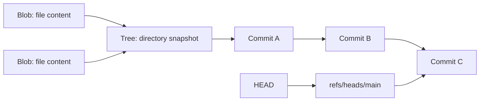

# Git Mental Model

[← Module overview](index.md) · [Master competency map](../master-competency-map.md)

Last reviewed: **2026-10-10**

## Git stores a graph, not file versions

Git is a distributed content-addressed object database. A repository contains
objects and names that point into a directed acyclic commit graph.

| Object or state | Meaning |
| --- | --- |
| Blob | File content, independent of its path |
| Tree | Directory names, modes, and references to blobs/subtrees |
| Commit | Root tree, parent commit(s), author/committer metadata, and message |
| Annotated tag | Named object with tagger/message and optional signature |
| Reference | Mutable name containing an object ID or symbolic reference |
| HEAD | Symbolic/current checkout position; can also be detached |
| Index | Proposed next tree and merge-conflict staging area |
| Working tree | Materialized editable files for the current checkout |

Object IDs protect integrity by identifying content and metadata. They do not
prove that the author identity is genuine or that the content is trustworthy.

## Branches are movable names

A branch is not a container of commits. It is a reference that advances when a
new commit is created on it. Commits can be reachable from several branches or
from none. Deleting a branch removes a name, not necessarily the objects.

A detached HEAD points directly to a commit. New commits are valid but need a
reference before reflog expiry and garbage collection make recovery harder.

## Local and remote state

- `main` is a local branch.
- `origin/main` is the local remote-tracking observation from the last fetch.
- the server's `main` is external state that may have advanced again.
- `origin` is a conventional remote name, not a special trust boundary.

Fetch updates remote-tracking references and objects without integrating them
into the current branch. Pull is a convenience operation that fetches and then
integrates according to configuration; state the merge/rebase behavior explicitly.

## Reachability and retention

Objects remain while reachable from references or protected by retention such
as reflogs. Garbage collection can eventually remove unreachable objects. A
backup strategy must include repository objects, critical refs/tags, server-side
configuration, issues/PR metadata, release assets, and restoration tests.

## Identity and time

Author records who originally wrote a change; committer records who created the
commit object. Both are configurable metadata. Signed commits/tags add
cryptographic verification, but trust still depends on key identity, lifecycle,
policy, and the platform's verification rules.

## Strong interview answer

Draw the before/after graph. Name which references move, whether commit IDs are
recreated, which published history consumers are affected, the safest recovery
reference, and how the remote policy constrains the operation.
