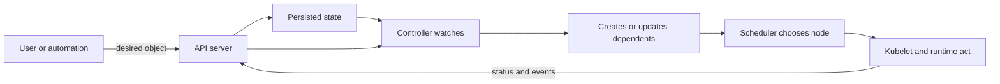

# Kubernetes Mental Model

[← Module overview](index.md) · [Master competency map](../master-competency-map.md)

Last reviewed: **2026-10-10**

Kubernetes is a distributed control system for reconciling declared API objects
toward observed state. It does not make applications reliable automatically; it
repeatedly applies controllers, scheduling, and node agents to the contracts you define.

## Desired, observed, and current state

A successful API response means the desired object was accepted and persisted; it
does not mean the workload is running or healthy. Controllers observe objects and
external state, calculate a difference, act, and retry until convergence or a
persistent constraint prevents it.

## Object anatomy

- **Metadata:** name, namespace, UID, resource version, labels, annotations, owner
  references, finalizers, and managed fields.
- **Spec:** desired state supplied by users/controllers.
- **Status:** observed state reported by controllers/agents.
- **Conditions:** typed observations with status, reason, message, and transition time.

Names can be reused after deletion; UIDs distinguish object identities. Resource
versions support optimistic concurrency and watches, not business versioning.
Labels select/group objects; annotations hold non-identifying metadata. Do not put
secrets or unbounded data in either.

## Ownership and garbage collection

Controllers create dependent objects with owner references. Garbage collection can
remove dependents when an owner is deleted, subject to propagation policy and valid
ownership scope. A finalizer delays deletion so a controller can complete cleanup;
it is not a protection flag. A stuck finalizer means responsible cleanup is not
finishing or the controller is absent.

## Declarative does not mean conflict-free

Multiple actors may update different fields. Server-side apply records field
managers and detects ownership conflicts. Reconciliation loops can fight when two
controllers believe they own the same outcome or when emergency manual changes are
not reflected in the source of truth.

Design a single authoritative owner for each field/outcome, explicit exception
paths, and observable drift. Avoid continuously replacing whole objects when a
narrow update or declarative manager is appropriate.

## Consistency and failure expectations

Kubernetes components are distributed and cache/watch state. Status can lag; watches
can reconnect; controllers retry; endpoints change; nodes partition; and cloud API
operations partially succeed. Design idempotent reconciliation and evaluate multiple
signals rather than treating one event or dashboard row as instantaneous truth.

## API and workload boundaries

Kubernetes schedules and supervises workloads, but the application still owns data
correctness, graceful shutdown, dependency resilience, request idempotency, and
business health. The cloud provider owns different infrastructure layers in EKS,
AKS, and GKE, while the customer still owns workload configuration and many
availability/security choices.

## Interview test

For any failure, ask: what is the desired object, who owns it, what is currently
observed, which controller should reconcile it, what dependency prevents progress,
and what evidence proves recovery?
