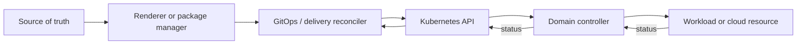

# Kubernetes Ecosystem Decision Model

[← Module overview](index.md) · [Master competency map](../master-competency-map.md)

Last reviewed: **2026-10-10**

An ecosystem component is a production dependency with APIs, controllers, identities,
failure modes, upgrades, data, and operators. “Cloud native” or CNCF membership is not
an architecture decision. Begin with an unmet capability and measurable outcome.

## Decision sequence

1. Define the user/problem, current failure, constraints, and success measure.
2. Check whether upstream Kubernetes or the managed platform already meets the need.
3. Compare build, adopt, managed service, and intentionally-do-nothing options.
4. Identify new controllers, CRDs/webhooks, data planes, identities, and privileges.
5. Test compatibility, scale, failure, upgrade, backup, removal, and team competence.
6. Pilot with an exit criterion; standardize only after evidence.

## Evaluation matrix

| Dimension | Questions |
| --- | --- |
| Capability | Which required outcome is missing today? Which features are essential? |
| Architecture | Control/data plane, APIs/CRDs, reconciliation owner, state, dependencies? |
| Security | Privileges, identities, supply chain, admission, network/data access, audit? |
| Reliability | HA, failure policy, backpressure, degradation, recovery, blast radius? |
| Compatibility | Kubernetes/cloud/runtime versions, API lifecycle, other controllers? |
| Operations | Installation, upgrade, observability, backup, support, on-call competence? |
| Portability | Upstream contract versus provider/product-specific configuration/data? |
| Economics | Compute, network, storage, licenses, telemetry, toil, training, opportunity cost? |
| Exit | Export/restore data, remove finalizers/webhooks/CRDs, replace API, migration time? |

## Controller ownership map

For every field/outcome, identify one authoritative writer and which actors may add
status or temporary changes. Helm, Kustomize, GitOps, admission mutation, operators,
autoscalers, and humans can all touch related state. Unclear ownership creates drift,
apply conflicts, reconciliation fights, and emergency changes that do not persist.

## API and data gravity

CRDs are versioned APIs stored in the cluster. Adoption creates consumers, manifests,
policy, status history, and sometimes external resources. Evaluate schema evolution,
conversion/defaulting, storage version, backup/restore, controller absence, deletion,
and export before treating a CRD as harmless configuration.

Data-plane additions—sidecars, node agents, proxies, eBPF programs, gateways—affect
latency, resources, failure scope, kernel/network behavior, and incident evidence.
Control-plane convenience must be weighed against workload-path complexity.

## Maturity evidence

Assess active maintainers and governance, release/security policy, compatibility and
deprecation commitments, upgrade notes, conformance/interoperability tests, issue and
incident transparency, support options, adoption evidence, and documented limits.
Popularity and repository stars are weak proxies.

## Platform product contract

Standardize a small supported path with clear versions, configuration interface,
SLOs, ownership, escalation, upgrade cadence, exceptions, costs, and documentation.
Allow experimentation in bounded environments. A platform that installs every useful
tool transfers integration risk to application teams rather than reducing it.

## Interview test

A strong answer explains why the capability is needed, who owns each control loop,
how it fails, what it costs, how it upgrades, and how it can be removed—not just which
project is most popular.
