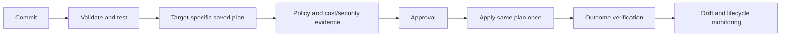

# Automation, Drift, and Lifecycle Operations

[← Module overview](index.md) · [Master competency map](../master-competency-map.md)

Production IaC is a long-running control system. Its difficult work is not initial
creation; it is safe change, interrupted execution, drift, refactoring, upgrades,
ownership transfer, and retirement.

## Delivery workflow

Use one serialized apply queue per state. Cancel superseded plans, expire old approvals,
and regenerate after state, code, inputs, identity, or remote infrastructure changes.
Production applies need protected environments and a clear human or policy approval
contract.

## Drift model

Classify drift before remediation:

- **Emergency drift:** authorized incident change awaiting source reconciliation.
- **Benign external ownership:** ignored or read-only field with explicit owner.
- **Unauthorized change:** control violation requiring containment and investigation.
- **Provider normalization:** semantically equivalent representation or provider defect.
- **Imported legacy difference:** configuration does not yet describe the real object.

Scheduled speculative/refresh plans can detect drift, but alert on actionable risk rather
than every computed difference. Do not automatically apply all drift; automation could
reverse an incident mitigation or destroy an externally owned change.

## Import and brownfield adoption

Inventory the object, dependencies, current safeguards, and owner. Write configuration,
declare/import the binding, and iterate until the plan is intentionally empty or contains
approved changes. Adopt in small failure domains. Import establishes identity; it does
not generate a correct operating model.

## Refactoring safely

Use moved declarations or supported state move operations when resource addresses change.
Separate address refactors from behavioral changes. Back up state, test with representative
state, inspect for replacement, and document compatibility. Changing `count` to
`for_each`, module nesting, or keys can alter addresses even when cloud intent is unchanged.

## Provider and tool upgrades

1. Read compatibility, deprecation, and state-format notes.
2. Update constraints and lock selections in a dedicated change.
3. test validation and representative plans across supported roots;
4. canary low-risk environments and inspect normalization/replacement;
5. roll out in bounded waves with pause criteria;
6. retain executable, lock, state backup, and rollback/forward guidance.

Downgrading a binary is not guaranteed to downgrade state or provider behavior safely.

## Incident sequence

1. Protect customers and freeze conflicting applies.
2. Preserve plan, state version, logs, lock metadata, revision, identity, and audit events.
3. Establish which API actions and graph nodes completed.
4. Compare configuration, state, and real infrastructure.
5. Choose roll-forward, restore/rebind state, or explicit cloud recovery.
6. generate and review a fresh plan;
7. verify service and control outcomes;
8. reconcile emergency changes and improve the guardrail.

Avoid routine `-target` use. It is a recovery tool for exceptional bounded cases and can
produce an incomplete view of the desired graph.

## Operational measures

Track plan wait time, apply success and partial failure, destructive/replacement rate,
drift age, state lock duration, module/provider version adoption, exception age, recovery
time, change failure, provisioning lead time, and customer outcome. “Number of resources
managed” measures inventory, not platform quality.
