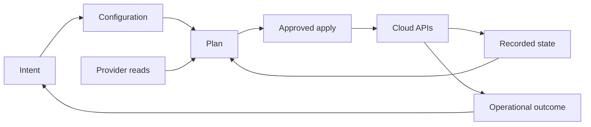

# Infrastructure-as-Code Decision Model

[← Module overview](index.md) · [Master competency map](../master-competency-map.md)

Infrastructure as Code (IaC) is an operating model in which versioned declarations,
reviewed changes, automated evaluation, and controlled reconciliation manage
infrastructure. A `.tf` file alone is not an operating model.

## The five-state mental model

Separate these states during design and diagnosis:

1. **Intent** — business requirement and architecture decision.
2. **Configuration** — versioned declarations, module versions, and inputs.
3. **Recorded state** — bindings and metadata known to Terraform/OpenTofu.
4. **Observed remote state** — what providers read from cloud APIs.
5. **Actual outcome** — whether users receive the required security, reliability,
   performance, and cost behavior.

A successful apply aligns configuration, recorded state, and provider observations.
It does not automatically prove the business outcome.

## Decide whether IaC should own the resource

Ask in order:

1. Is the object durable desired state or a short-lived operational action?
2. Does a stable provider/API expose the lifecycle safely?
3. Can one root configuration be its authoritative owner?
4. Can credentials, state, and blast radius be bounded?
5. Is import, replacement, recovery, and eventual removal understood?

Use IaC for durable infrastructure and policy. Prefer deployment controllers for
application rollout, configuration systems for host convergence, and operational
automation for one-time repair. Avoid two systems managing the same property.

## Core invariants

- One authoritative root owns each resource address.
- State is protected data and a coordination record, not an ordinary artifact.
- Plans are proposals tied to code, inputs, credentials, provider versions, and state.
- Apply authority is narrower than read/plan authority.
- A module is a supported product contract, not a folder of reusable resources.
- Every irreversible or replacement-prone change needs explicit evidence and recovery.
- Manual exceptions expire or are reconciled into the declared source of truth.

## Evaluation dimensions

| Dimension | Questions |
| --- | --- |
| Outcome | What risk, speed, consistency, or audit problem does IaC solve? |
| Ownership | Which team owns code, state, credentials, module, provider, and cloud outcome? |
| Boundary | What is the root module's account, region, environment, and failure radius? |
| Trust | Who can propose, approve, execute, read state, and bypass controls? |
| Lifecycle | How are import, rename, move, replacement, upgrade, and deletion handled? |
| Evidence | Which plan, policy result, approval, apply log, and cloud audit prove change? |
| Portability | Which choices are HCL/provider-neutral and which embed platform semantics? |
| Exit | Can state and ownership migrate between runners, backends, or compatible tools? |

## Declarative does not mean autonomous

The engine calculates actions, but humans still choose boundaries, provider behavior,
lifecycle rules, approval criteria, and recovery. Provider schemas can mark attributes
as replacement-only; cloud APIs may be eventually consistent; unknown values can defer
decisions until apply; and side effects can outlive a failed run.

## AWS anchor and cloud translation

An AWS root commonly operates within a bounded account and region using an assumed IAM
role. Azure usually substitutes subscription/resource-group and workload identity
boundaries. GCP substitutes organization/folder/project and service-account boundaries.
The reusable principle is blast-radius-aligned state and short-lived identity—not an
identical folder structure across clouds.

## Interview close

Lead with: “I treat IaC as a controlled reconciliation system. I first define ownership
and state boundaries, then identity and review controls, then module contracts and
recovery. The tool is important, but safe lifecycle design is the architecture.”
