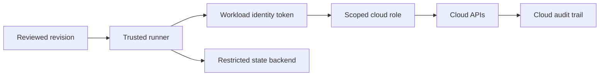

# Providers, Identity, and Multi-Cloud

[← Module overview](index.md) · [Master competency map](../master-competency-map.md)

Providers translate graph operations into external API calls. They are executable supply-
chain dependencies with schemas, credentials, permissions, retry behavior, and lifecycle
semantics—not passive libraries.

## Provider governance

- Declare source addresses and compatible version constraints.
- Commit and review the dependency lock file for root configurations.
- Mirror or allow-list providers when supply-chain requirements demand it.
- Test upgrades against representative state and inspect schema-driven replacements.
- Track provider ownership, support policy, security advisories, and rollback method.
- Do not let reusable child modules silently configure credentials.

## Identity architecture

Use workload identity federation from the CI platform to short-lived cloud credentials.
Avoid static cloud access keys in repository secrets. Separate identities for planning,
applying, break-glass recovery, and backend administration where meaningful.

The runner is part of the trust boundary. Pin workflow dependencies, isolate untrusted
pull requests, protect environments, restrict outbound access where justified, and never
expose apply credentials to code that has not passed the approval boundary.

## AWS provider design

- Bootstrap state storage and execution roles through a separately controlled foundation.
- Use role assumption or workload identity, session naming, external conditions, and
  organization/account restrictions.
- Use provider aliases explicitly for multiple accounts or regions.
- Keep the default provider safe; accidental fallback must not target production.
- Add policy guardrails and service-native protections beyond the Terraform role.
- Record CloudTrail evidence and connect the session to the pipeline run and revision.

## Azure translation

Use federated workload identity or managed identity with scoped role assignments. Make
tenant and subscription explicit, govern management-group operations separately, and
account for resource-provider registration and Azure control-plane propagation.

## GCP translation

Use Workload Identity Federation and service-account impersonation with narrow project or
organization roles. Treat project creation, service enablement, shared VPC, and folder/
organization policy as foundation lifecycles with separate authority.

## Multiple provider configurations

Aliases are appropriate for deliberate cross-account, cross-region, or cross-subscription
operations. Pass aliases to child modules explicitly. Avoid dynamic provider selection
that hides the target during review. A resource moving between provider configurations
may require a supported state operation, not merely an HCL edit.

## Provider failure reasoning

Classify failures as authentication, authorization, quota, throttling, eventual
consistency, API validation, provider defect, or remote service failure. Preserve the
plan and logs, identify which graph nodes completed, inspect audit events, and refresh
before retrying. Raising timeouts or retries without classification can enlarge impact.

## Least-privilege tension

Plans often need broad read access; applies need precise write actions that vary by
resource lifecycle. Start with capability-specific execution roles, use cloud audit data
to refine, and retain explicit denies and organizational guardrails. A single enterprise-
wide administrator role makes module reuse easy by transferring risk to every run.
