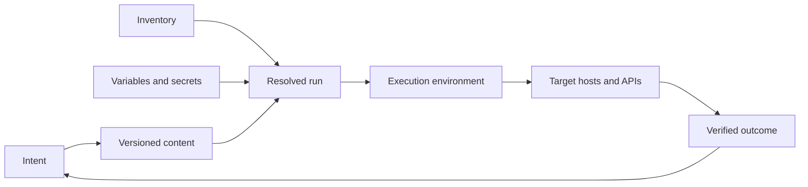

# Configuration-Management Decision Model

[← Module overview](index.md) · [Master competency map](../master-competency-map.md)

Ansible executes automation from a control node through connection plugins and
modules. It is usually agentless, but "no resident agent" does not mean "no
platform": inventory, identity, runtime dependencies, content, logging, and
recovery still require ownership.

## The six-part mental model

1. **Intent** — policy or operational outcome.
2. **Targets** — resolved inventory and host limits.
3. **Data** — variables, facts, secrets, and precedence.
4. **Content** — playbooks, roles, collections, modules, and templates.
5. **Execution** — runtime image, identity, strategy, batch, and controller.
6. **Outcome** — target state and verified service behavior.

## Choose the right mechanism

| Need | Prefer | Why |
| --- | --- | --- |
| Durable cloud-resource lifecycle | Terraform/OpenTofu or cloud-native IaC | State and dependency planning |
| Immutable base operating system | Image pipeline | Repeatable artifact and replacement |
| First-boot bootstrap | Cloud-init or image configuration | Available before general remote automation |
| Ongoing host configuration | Ansible or managed configuration service | Convergence across existing targets |
| Event-driven remediation | Guarded automation triggered by observation | Faster response with bounded authority |
| One-time investigation | Human-approved diagnostic workflow | Evidence and explicit scope |

Avoid using Ansible as a generic shell fan-out tool. Prefer purpose-built modules
that expose desired state and changed status. Use commands only behind explicit
guards, validation, and recovery logic.

## Push, pull, and immutable models

- **Push** centralizes scheduling and credentials but depends on reachability and
  controller capacity.
- **Pull** lets nodes reconcile independently but adds resident runtime,
  distribution, and consistency concerns.
- **Immutable replacement** reduces configuration drift but does not eliminate
  runtime configuration, secret, or orchestration needs.

Large platforms commonly combine them: bake a secure image, provision with IaC,
use a managed service for bootstrap and patch policy, and reserve Ansible for
cross-system orchestration or configuration that cannot yet be immutable.

## Ownership questions

Before approving automation, ask:

1. What object or outcome does this content own?
2. Which system is authoritative if another tool can change it?
3. How are targets resolved and reviewed before execution?
4. What identity and escalation boundary does the run receive?
5. Is repeated execution safe and predictably convergent?
6. What is the failure radius, stop condition, and recovery path?
7. What evidence proves both configuration and customer outcome?

## AWS-first translation

For AWS, evaluate EC2 tags and account/region boundaries, Systems Manager
connectivity, instance profiles, short-lived controller roles, private endpoints,
and CloudTrail evidence. On Azure, translate to resource graph/tag inventory,
managed identities, and Azure Arc or VM access. On GCP, translate to labels,
service-account impersonation, OS Login, and fleet/project boundaries.

Return to the [module overview](index.md) when ready to continue.
