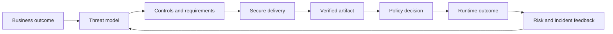

# Secure-Delivery Decision Model

[← Module overview](index.md) · [Master competency map](../master-competency-map.md)

DevSecOps integrates security into product and platform decisions while preserving
delivery flow. "Shift left" is incomplete: design early, verify throughout,
enforce at trusted boundaries, observe runtime, and feed incidents back into design.

## Seven-part mental model

1. **Outcome** — business service and acceptable risk.
2. **Threat** — actor, capability, path, asset, and impact.
3. **Control** — preventive, detective, responsive, or recovery measure.
4. **Trust** — identity, environment, input, artifact, and policy boundaries.
5. **Evidence** — attributable proof about code, build, artifact, deployment, and runtime.
6. **Decision** — allow, warn, block, quarantine, or exception.
7. **Feedback** — vulnerability, incident, exploit, and delivery data that improve design.

## Control placement

Use the earliest reliable control with a later independent verification point.
IDE feedback is fast but bypassable; CI has context but may be compromised;
registry controls protect distribution; admission sees deployment intent; runtime
controls observe actual behavior. No single gate provides complete assurance.

## Security responsibility

- Product teams own design, code, dependency choices, fixes, and service risk.
- Platform teams own paved workflows, identity, build isolation, evidence, and guardrails.
- Security teams own standards, threat guidance, high-risk policy, intelligence,
  exception oversight, and assurance—not every remediation ticket.
- Risk owners accept residual business risk with scope and expiry.

## Scanner versus decision

A scanner produces evidence with uncertainty. A decision combines evidence with
artifact identity, exploitability, reachability, exposure, asset criticality,
compensating controls, and policy. Deduplicate and enrich findings before assigning
work; raw alert count is not risk.

## AWS-first translation

On AWS, consider IAM federation, isolated CodeBuild or other runners, ECR,
Inspector, Security Hub, CloudTrail, KMS, Organizations, and EKS admission/runtime
boundaries. Translate to Microsoft Entra/workload identity, Defender and Azure
Policy on Azure; and service-account federation, Artifact Analysis, Binary
Authorization, Security Command Center, and organization policy on Google Cloud.

Return to the [module overview](index.md) when ready to continue.
