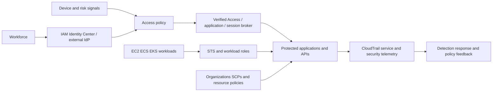

# AWS-First and Multi-Cloud Architecture

[← Module overview](index.md) · [Master competency map](../master-competency-map.md)

A Zero Trust target state is a connected set of controls and ownership boundaries,
not a vendor checklist. Use common outcomes across clouds while respecting each
provider's identity hierarchy, policy language, resource model, and logging.

## AWS reference pattern

### Control planes

- **Organization:** isolate accounts by workload and environment; apply SCPs,
  delegated administration, baseline logging, and protected security accounts.
- **Workforce:** federate through IAM Identity Center; use permission sets,
  short sessions, stronger privileged controls, and access review.
- **Workload:** use STS-backed service identities—task roles, instance profiles,
  Lambda roles, and pod-specific identity—rather than shared access keys.
- **Application access:** use identity-aware access such as Verified Access where
  suitable, or enforce equivalent policy at gateways and applications.
- **Resource/data:** combine identity policy, resource policy, KMS key policy,
  data classification, and AWS data-perimeter condition keys.
- **Network:** restrict paths with accounts, VPCs, security groups, Network
  Firewall, private endpoints, and egress controls; do not treat them as identity.
- **Evidence:** centralize CloudTrail, identity, access, network, application, and
  security findings with protected retention and response automation.

## Capability translation

| Outcome | AWS | Azure | Google Cloud |
| --- | --- | --- | --- |
| Workforce federation | IAM Identity Center | Microsoft Entra ID | Cloud Identity / Workforce Identity Federation |
| Adaptive access | Verified Access plus IdP/device signals | Conditional Access | Context-Aware Access |
| Privileged access | scoped roles and governed elevation | Privileged Identity Management | Privileged Access Manager |
| Workload identity | IAM roles, STS, EKS Pod Identity/IRSA | managed identities, workload identity | service accounts, Workload Identity Federation |
| Organization guardrail | Organizations SCP | management group and Azure Policy | organization policy |
| Secrets and keys | Secrets Manager, KMS, ACM/Private CA | Key Vault, Managed HSM | Secret Manager, Cloud KMS, CA Service |
| Security evidence | CloudTrail, GuardDuty, Security Hub | Azure Monitor, Defender for Cloud | Cloud Audit Logs, Security Command Center |

These are capability anchors, not one-to-one equivalents. Validate supported
signals, evaluation order, limits, regional behavior, and log semantics before
claiming parity.

## Data perimeter

Express which identities may access which owned resources from which expected
networks and through which services. On AWS, organization and resource policies
can provide broad preventive guardrails while fine-grained IAM and application
policy remain necessary. Test service-to-service calls and confused-deputy
conditions so perimeter controls do not break legitimate managed-service flows.

## Architecture review questions

Which control is authoritative? Can any alternate path bypass it? What happens
during IdP, policy, DNS, or certificate failure? Which team owns policy and
resource metadata? How are multi-cloud exceptions reconciled without reducing
every provider to the weakest common feature?

Return to the [module overview](index.md) when ready to continue.
