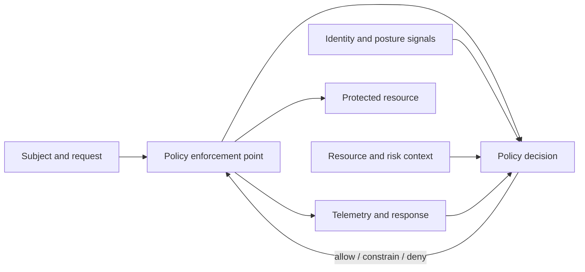

# Zero Trust Decision Model

[← Module overview](index.md) · [Master competency map](../master-competency-map.md)

NIST defines Zero Trust as a shift from static, network-based perimeters toward
protecting users, assets, and resources. Trust is never granted solely because a
request originates from a corporate network, managed account, or previously
authenticated session. The goal is not zero confidence; it is explicit,
evidence-based, time-bounded authorization.

## Seven-part mental model

1. **Resource** — application, API, data, action, or infrastructure to protect.
2. **Subject** — human, device, workload, service, or automated agent requesting it.
3. **Signals** — identity assurance, device posture, workload provenance, location,
   behavior, threat intelligence, resource sensitivity, and request context.
4. **Policy** — testable rules derived from business risk and ownership.
5. **Decision** — allow, deny, constrain, challenge, step up, or revoke.
6. **Enforcement** — gateway, identity provider, application, API, host, cloud
   control plane, or data service that applies the decision.
7. **Feedback** — logs, incidents, access reviews, exceptions, and outcomes used
   to improve signals and policy.

## Core principles

- **Explicit verification:** authenticate and authorize subjects and requests
  using current, relevant evidence.
- **Least privilege:** reduce permitted actions, resources, duration, and paths.
- **Assume breach:** limit blast radius, detect misuse, preserve evidence, and
  make revocation and recovery routine.
- **Protect resources, not locations:** start with critical transactions and data,
  then discover the flows and dependencies required to serve them.

## Policy decision anatomy

For every important transaction, state: who or what is acting; which resource and
action are requested; which signals are authoritative; who owns the policy; where
it is enforced; how long the decision lasts; what is logged; what happens when a
signal or dependency is unavailable; and how emergency access works.

## Common misconceptions

- A VPN authenticates a connection; it does not authorize every downstream action.
- Microsegmentation limits paths; it does not establish user or workload identity.
- MFA improves authentication but cannot repair excessive authorization.
- mTLS authenticates certificate holders, not the safety or intent of their code.
- Continuous evaluation means responding to meaningful state changes, not forcing
  disruptive authentication on every packet.
- Zero Trust does not replace patching, encryption, backups, detection, or recovery.

## Architecture test

A credible design can answer: *Which implicit trust is removed? Which evidence
replaces it? At what boundary is policy enforced? How does access expire or get
revoked? What fails safely without making the business unrecoverable?*

Return to the [module overview](index.md) when ready to continue.
