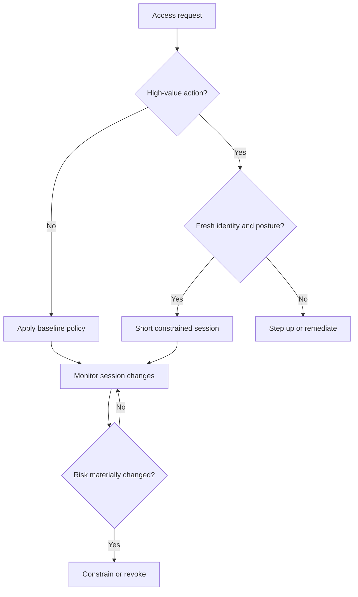

# Devices, Context, and Adaptive Access

[← Module overview](index.md) · [Scenario answer framework](../interview-playbook/scenario-answer-framework.md)

A device is another subject and signal source, not a trusted extension of the
user. A managed laptop can still be compromised; an unmanaged device can
sometimes receive a safe, constrained experience.

## Useful posture signals

- enrollment and ownership state;
- cryptographic device identity and attestation where available;
- supported operating-system and security-patch level;
- disk encryption, screen lock, secure boot, and endpoint protection health;
- local firewall, prohibited software, jailbreak/root, and compromise indicators;
- certificate, configuration baseline, and last-seen freshness.

Classify signals by authority, freshness, spoof resistance, privacy impact, and
failure behavior. Do not collapse them into an unexplained "trusted device" flag.

## Adaptive decision pattern

Combine user authentication assurance, device posture, resource sensitivity,
requested action, session age, behavior, threat intelligence, network context,
and transaction risk. Responses include allow, read-only access, download block,
step-up authentication, isolated browser, session termination, or deny.

## BYOD and contractors

Start from data and action requirements. Options include browser-only access,
virtual applications/desktops, tenant restrictions, copy/download prevention,
short sessions, managed application containers, and sponsor-bound expiry. Avoid
collecting unnecessary personal telemetry; document consent, retention, and
regional privacy requirements.

## Reliability and safety

Posture systems and risk engines can fail. Decide per resource whether to deny,
allow a reduced capability, use recently verified state for a bounded period, or
invoke emergency access. Monitor false denies, help-desk pressure, bypasses, stale
signals, and control outages. A policy that users routinely evade is not mature.

Return to the [module overview](index.md) when ready to continue.
