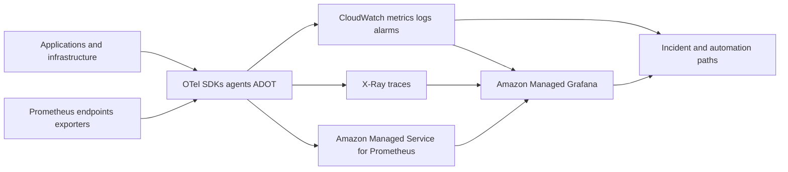

# AWS-First and Multi-Cloud Architecture

[← Module overview](index.md) · [Master competency map](../master-competency-map.md)

Use open signal contracts and provider-native integrations deliberately. Portability
comes from stable instrumentation, semantics, and ownership—not from pretending
that every backend, query language, or managed service behaves identically.

## AWS reference pattern

## AWS control choices

- **Instrumentation/collection:** OpenTelemetry SDKs and AWS Distro for
  OpenTelemetry (ADOT), plus native service and infrastructure integrations.
- **Metrics:** CloudWatch for AWS-native metrics/alarms and Amazon Managed Service
  for Prometheus (AMP) for Prometheus-compatible ingestion and PromQL.
- **Logs:** CloudWatch Logs for managed ingestion/query and subscriptions;
  OpenSearch where search/analytics requirements justify another backend.
- **Traces:** X-Ray-compatible tracing through ADOT and AWS service integrations.
- **Visualization:** CloudWatch dashboards for native operations and Amazon
  Managed Grafana (AMG) for multi-source dashboards and correlation.
- **Events/changes:** EventBridge, CloudTrail, AWS Config, deployment and application
  events correlated with service telemetry.

Use IAM roles for workloads and collectors, private connectivity where useful,
KMS encryption, resource policies, tenant/account boundaries, centralized archive,
and explicit cross-account observability. Separate monitoring/telemetry accounts
to reduce workload blast radius while preserving controlled team access.

## Capability translation

| Outcome | AWS | Azure | Google Cloud |
| --- | --- | --- | --- |
| Native metrics/logs | CloudWatch | Azure Monitor / Log Analytics | Cloud Monitoring / Logging |
| Application tracing | X-Ray plus ADOT | Application Insights / Azure Monitor OTel | Cloud Trace / OTel |
| Managed Prometheus | Amazon Managed Service for Prometheus | Azure Monitor managed service for Prometheus | Managed Service for Prometheus |
| Managed Grafana | Amazon Managed Grafana | Azure Managed Grafana | self-managed or partner/SaaS integration |
| Search/analytics | OpenSearch Service | Log Analytics / Data Explorer | Log Analytics / BigQuery patterns |
| Audit/change evidence | CloudTrail, Config, EventBridge | Activity Log, Resource Graph, Event Grid | Cloud Audit Logs, Asset Inventory, Eventarc |

Validate regional availability, quotas, retention, ingestion and query pricing,
identity model, private access, rule semantics, and supported OpenTelemetry
components. Capability names do not guarantee equivalent data or failure behavior.

## Hybrid and multi-cloud

Use regional collectors and controlled egress, preserve source-cloud resource
identity, and choose whether data remains local, is federated at query time, or is
copied into a central platform. Consider residency, latency, WAN failure, egress
cost, sovereign access, common schema, clock quality, and incident access when the
central control plane is unavailable.

Return to the [module overview](index.md) when ready to continue.
