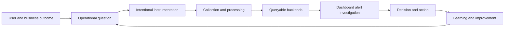

# Observability Decision Model

[← Module overview](index.md) · [Master competency map](../master-competency-map.md)

Monitoring evaluates known conditions. Observability enables investigation of
known and previously unanticipated questions from system outputs. They reinforce
each other: monitoring tells responders *that* a meaningful condition exists;
observability helps explain *where, for whom, why, and what changed*.

## Seven-part mental model

1. **Outcome** — user journey, business transaction, reliability objective, or risk.
2. **Question** — decision the operator, developer, security team, or owner must make.
3. **Signal** — metric, log, trace, profile, event, topology, or change evidence.
4. **Context** — service, environment, version, region, tenant class, request, and owner.
5. **Pipeline** — generation, collection, processing, transport, storage, and retention.
6. **Experience** — query, dashboard, alert, notebook, correlation, and runbook workflow.
7. **Feedback** — incident, cost, quality, and product learning that changes the system.

## Signal strengths and limits

| Signal | Strength | Common limitation |
| --- | --- | --- |
| Metrics | efficient aggregation, trends, alerting | labels can explode; detail is lost |
| Logs/events | rich discrete evidence and audit narrative | volume, inconsistent fields, sensitive data |
| Traces | request causality, latency decomposition, dependency paths | sampling and propagation gaps |
| Profiles | code-level CPU, memory, lock, or allocation cost | attribution and retention overhead |
| Changes/topology | explains what and where the system changed | incomplete inventory or correlation |

No signal is the universal source of truth. Correlation should preserve the
different semantics rather than copying every attribute into every signal.

## Design from questions

For a critical journey, ask: Is it available? Is it fast enough? Is it correct?
Which users, versions, regions, or dependencies are affected? What changed? Can
we safely mitigate? Instrument the minimum evidence needed to answer those
questions, then verify during failure exercises that the evidence is actually usable.

## Anti-patterns

- collecting everything without ownership, retention, or a question;
- dashboards that show infrastructure activity but not user outcome;
- alerts that name a threshold but no service, impact, owner, or response;
- calling logs "structured" because they are JSON while fields remain inconsistent;
- treating an agent rollout or telemetry volume as observability maturity;
- making the application dependent on telemetry export success.

## Quality dimensions

Evaluate coverage, correctness, completeness, timeliness, correlation,
availability, query performance, cost, privacy, ownership, and actionability.
Telemetry can be wrong, delayed, duplicated, sampled, dropped, or unavailable;
architects make that uncertainty visible.

Return to the [module overview](index.md) when ready to continue.
