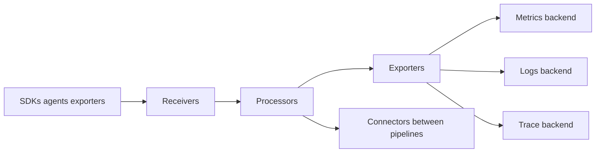

# OpenTelemetry and Collector Pipelines

[← Module overview](index.md) · [OpenTelemetry references](references.md#opentelemetry)

OpenTelemetry defines vendor-neutral APIs, SDKs, semantic conventions, context
propagation, OTLP, and collection components for traces, metrics, and logs.
It generates and moves telemetry; it does not provide the durable backend,
query language, dashboard, or incident process by itself.

## Instrumentation layers

- **API:** application/library calls that create telemetry without selecting a backend.
- **SDK:** sampling, processing, resource detection, and export implementation.
- **Auto-instrumentation:** low-code coverage for supported frameworks and runtimes.
- **Manual instrumentation:** domain spans, metrics, events, and business context.
- **Semantic conventions:** consistent operation, resource, and attribute names.
- **OTLP:** protocol for transporting telemetry between components.

Auto-instrumentation provides fast breadth; manual instrumentation supplies the
business meaning needed for SLOs and diagnosis. Pin compatible components and
verify signal/language stability instead of assuming every OpenTelemetry feature
has the same maturity.

## Collector pipeline

Receivers accept OTLP, Prometheus, file/syslog, or vendor formats. Processors
batch, limit memory, enrich, filter, transform, sample, or redact. Exporters send
to one or more backends. Connectors join pipelines as an exporter on one side and
a receiver on another. Extensions add capabilities such as health endpoints or
authentication; component stability must be assessed individually.

## Deployment patterns

| Pattern | Strength | Main trade-off |
| --- | --- | --- |
| In-process direct export | simple development path | backend coupling and application retry pressure |
| Agent/sidecar/DaemonSet | local buffering and host context | fleet overhead and per-node resource cost |
| Gateway | centralized policy, routing, sampling, egress | critical shared capacity and network dependency |
| Agent plus gateway | local offload plus centralized control | more components and duplicate failure modes |

Tail sampling generally needs trace affinity at the gateway so spans for one trace
reach the same decision component. Prometheus scraping may need stable target
discovery; blindly load-balancing scrape ownership can duplicate or miss series.

## Resilience

Protect applications from collector failure with non-blocking bounded export.
Set memory limits, batch sizes, sending queues, retry/backoff, timeouts, and
persistent queues where loss requirements justify them. Apply admission control
and tenant limits. Monitor accepted, refused, dropped, queued, retried, and failed
items plus collector CPU, memory, restarts, and configuration version.

## Governance and security

Authenticate clients and backends, encrypt transport, restrict collector admin
endpoints, validate components, and use least-privilege cloud identities. Redact
early, isolate tenants, version configuration as code, canary changes, and prevent
an unbounded transform or regex from becoming a platform-wide outage.

Return to the [module overview](index.md) when ready to continue.
