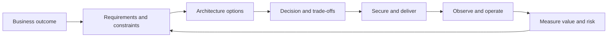

# Cloud & DevOps Architect Knowledge Base

This is a scenario-driven learning and interview-preparation system for senior
Cloud/DevOps Architects, Principal Engineers, Platform/SRE leaders, and
technical consultants.

It is intentionally organized around decisions rather than product trivia.
Knowing that a service exists is useful; knowing when it is appropriate, how it
fails, how it is secured and operated, and what it costs is architect-level
knowledge.

!!! tip "Start the available course here"
    Open [Module 01: Cloud Architecture & Distributed Systems](01-cloud-architecture/index.md)
    and follow its numbered learning path. Return to the table below when you are
    ready for the next released module.

## Current learning path

This is the canonical order for currently released learning material. Module IDs
preserve the full curriculum structure; Modules 02–05 are planned, so the current
path intentionally moves from Module 01 to Module 06.

| Study step | Module ID | Module |
| ---: | ---: | --- |
| 1 | 01 | [Cloud Architecture & Distributed Systems](01-cloud-architecture/index.md) |
| 2 | 06 | [Linux & OS Fundamentals](06-linux/index.md) |
| 3 | 07 | [Cloud Networking & DNS](07-networking/index.md) |
| 4 | 08 | [Git & Source-Control Strategy](08-git/index.md) |
| 5 | 09 | [CI/CD & Progressive Delivery](09-cicd/index.md) |
| 6 | 10 | [Docker & Container Engineering](10-docker/index.md) |
| 7 | 11 | [Kubernetes](11-kubernetes/index.md) |
| 8 | 12 | [Kubernetes Ecosystem](12-kubernetes-ecosystem/index.md) |
| 9 | 13 | [Terraform, OpenTofu & Infrastructure as Code](13-terraform/index.md) |
| 10 | 14 | [Ansible & Configuration Management](14-ansible/index.md) |
| 11 | 15 | [DevSecOps & Software Supply Chain](15-devsecops/index.md) |
| 12 | 16 | [Zero Trust Architecture](16-zero-trust/index.md) |

## How to use this knowledge base

1. Begin at the [Module 01 overview](01-cloud-architecture/index.md).
2. Follow the numbered module path; use the
   [master competency map](master-competency-map.md) only to inspect broader
   coverage and status.
3. Read the concepts without memorizing service lists.
4. Complete the design and troubleshooting exercises.
5. Answer scenarios aloud before reading the model answer.
6. Score yourself using the
   [scenario answer framework](interview-playbook/scenario-answer-framework.md).
7. Finish with active recall and the timed mock interview.
8. Revisit weak decisions with the linked primary sources.

## Architect decision loop

## Current release

The current release contains the repository foundation, Cloud Architecture &
Distributed Systems, Linux & OS Fundamentals, Cloud Networking & DNS, Git &
Source-Control Strategy, CI/CD & Progressive Delivery, Docker & Container
Engineering, Kubernetes, Kubernetes Ecosystem, and Terraform/OpenTofu
Infrastructure as Code, Ansible Configuration Management, DevSecOps and Software
Supply Chain, and Zero Trust Architecture. Remaining modules are tracked in the
competency map and will be delivered in priority waves.

!!! note "Version-aware content"
    Cloud services and open-source platforms change continuously. Each module
    records a review date and links to authoritative sources rather than
    duplicating fast-changing reference material.
