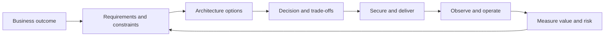

# Cloud & DevOps Architect Knowledge Base

This is a scenario-driven learning and interview-preparation system for senior
Cloud/DevOps Architects, Principal Engineers, Platform/SRE leaders, and
technical consultants.

It is intentionally organized around decisions rather than product trivia.
Knowing that a service exists is useful; knowing when it is appropriate, how it
fails, how it is secured and operated, and what it costs is architect-level
knowledge.

## How to use this knowledge base

1. Review the [master competency map](master-competency-map.md).
2. Follow the [study roadmap](roadmap.md) or select a weak area.
3. Read the module concepts without memorizing service lists.
4. Complete its design or troubleshooting lab.
5. Answer its scenarios aloud before reading the model answer.
6. Score yourself using the
   [scenario answer framework](interview-playbook/scenario-answer-framework.md).
7. Revisit weak decisions with the linked primary sources.

## Architect decision loop

## Current release

The repository foundation and the Cloud Architecture & Distributed Systems
pilot module form the first release. Remaining modules are tracked in the
competency map and will be delivered in priority waves.

!!! note "Version-aware content"
    Cloud services and open-source platforms change continuously. Each module
    records a review date and links to authoritative sources rather than
    duplicating fast-changing reference material.
